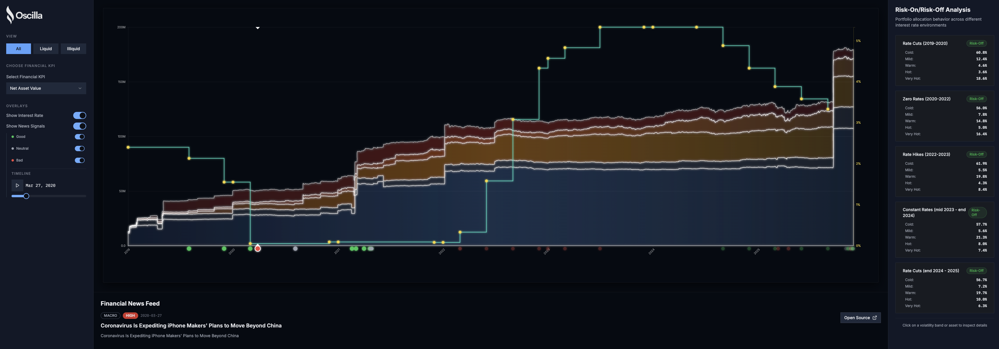
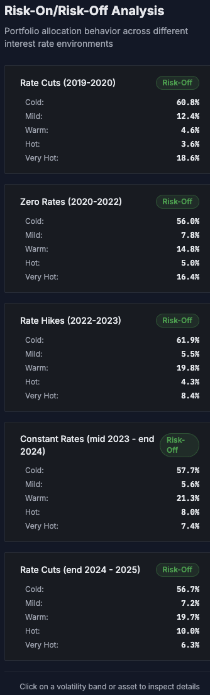
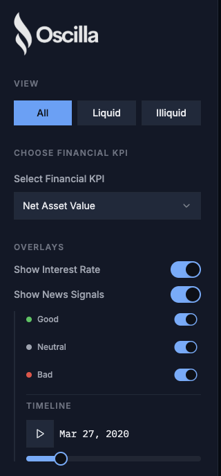
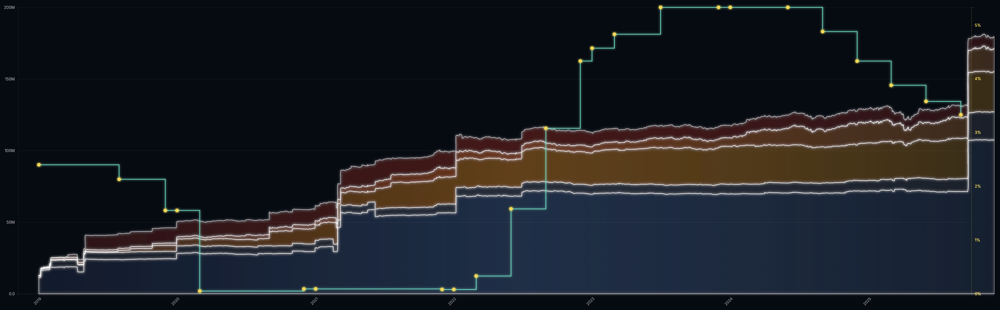
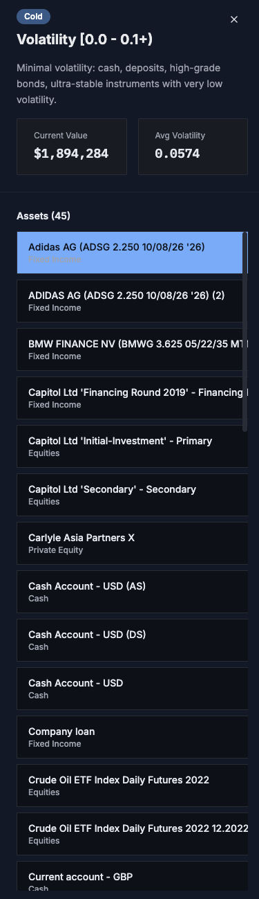

# Oscilla
**Team Name:** Maybe AI can solve this

See how your money moves. Oscilla shows where your portfolio's money flows across different risk groups over time. Connect the dots between market news, interest rates, and your investments in one clear view.
Team Name: 
---

## 0. Quick start

First, install and start the frontend app:

```sh
npm install
npm run dev
```

### Project structure

```
capital-flow-explorer/
├── README.md
├── index.html
├── package.json
├── tsconfig.json
├── vite.config.ts
├── src/                                                        # Frontend (React + TypeScript)
│   ├── main.tsx
│   └── lib/
│       └── dataTransformer.ts
├── python_sandbox/                                             # Python scripts for setup
│   └── data/
│       ├── access.py
│       ├── analyze_asset_buys_sells.py
│       ├── analyze_volatility.py
│       ├── comprehensive_asset_analysis.py
│       ├── replace_volatility_in_full_analysis.py
│       ├── asset_buy_sell_dates.json                           # Data used in the website
│       ├── asset_volatility.json                               # Data used in the website
│       ├── asset_volatility_from_full_analysis.json            # Data used in the website
│       ├── full_asset_analysis.json                            # Final file used in the web app
│       ├── full_asset_analysis_with_new_volatility.json        # Data used in the website
│       └── data/                                               # Raw JSON files generated by Python scripts
│           ├── security_691dd48d3022610895c102ea.json
│           ├── volatility_692b51eb7b0feeedced7dd5a.json
│           ├── news/                                           # Folder where the Hugging Face (NLP/news analysis) operates (e.g. inputs vs outputs dynamics)
│           └── ... (other raw data files)
```

Open your browser and explore your capital flows.

---

For working with the data pipeline (Python sandbox):

1. (Recommended) Create a virtual environment and install all dependencies:

   ```shgit c
   python -m venv .venv
   source .venv/bin/activate  # On Windows: .venv\Scripts\activate
   pip install -r python_sandbox/requirements.txt
   ```

2. Run the Python data preparation scripts:

   ```sh
   python python_sandbox/data/access.py
   python python_sandbox/data/analyze_asset_buys_sells.py
   python python_sandbox/data/comprehensive_asset_analysis.py
   ```

The Python scripts are provided in a sandbox folder so you can easily explore and modify/extend the data pipeline as you wish.

---
## 1. Insight Discovery

<div align="center" style="width:100%; margin: 20px 0;">
  
</div>

Our insight discovery is primarly focused on (one important variable in finance/economics), **the interest rate** and the idea of **grouping stocks** into **bundles of similar "risk"**. The main insight for the user of Oscilla is to understand his exposure across risk bundles of assets specially with respect to changes in interest rate levels and other **financial news** (e.g. Trump Tariffs, Tech. & Big Indexes).

<div align="center" style="width:100%; margin:18px 0;">
  
</div>

---

## 2. Technical Execution

Built with **React** and **TypeScript** for a fast, responsive experience—even with lots of data. We stand out by going beyond standard dashboards: a **Python-based structure** that collects, manipulates, and analyzes all portfolio and news data, using **real NLP models** (from Hugging Face) to classify news by sentiment, importance, and topic. Our python scripts connect to APIs, scrappes websites, and make very simple insights. Everything is set up so you can tweak, extend, or swap data sources without headaches—future-proof by design. Most importantly everything built with **open-source** tools.

<<<<<<< HEAD
<div align="center" style="width:100%; margin: 28px 0;">

| <div style="text-align:center">Frontend<br/><span style="font-size:13px; font-weight:normal; color:#888;">(UI/UX)</span></div> | <div style="text-align:center">Data Processing &amp; AI<br/><span style="font-size:13px; font-weight:normal; color:#888;">(Automation &amp; Analytics)</span></div> | <div style="text-align:center">Deployment<br/><span style="font-size:13px; font-weight:normal; color:#888;">(Cloud Hosting)</span></div> | <div style="text-align:center">Sponsors<br/><span style="font-size:13px; font-weight:normal; color:#888;">(Support)</span></div> |
|:---:|:---:|:---:|:---:|
|  | <br/> |  | <br/><br/> |

</div>
=======
|  <div style="text-align:center">Frontend<br/><span style="font-size:13px; font-weight:normal; color:#888;">(UI/UX)</span></div>  |                                    <div style="text-align:center">Data Processing &amp; AI<br/><span style="font-size:13px; font-weight:normal; color:#888;">(Automation &amp; Analytics)</span></div>                                     | <div style="text-align:center">Deployment<br/><span style="font-size:13px; font-weight:normal; color:#888;">(Cloud Hosting)</span></div> |                                                                                                                   <div style="text-align:center">Sponsors<br/><span style="font-size:13px; font-weight:normal; color:#888;">(Support)</span></div>                                                                                                                   |
| :------------------------------------------------------------------------------------------------------------------------------: | :----------------------------------------------------------------------------------------------------------------------------------------------------------------------------------------------------------------------------------------: | :--------------------------------------------------------------------------------------------------------------------------------------: | :------------------------------------------------------------------------------------------------------------------------------------------------------------------------------------------------------------------------------------------------------------------------------------------------------------------------------------------------------------------: |
|  | <br/> |                      | <br/><br/> |
|  <div style="text-align:center">Frontend<br/><span style="font-size:13px; font-weight:normal; color:#888;">(UI/UX)</span></div>  |                                    <div style="text-align:center">Data Processing &amp; AI<br/><span style="font-size:13px; font-weight:normal; color:#888;">(Automation &amp; Analytics)</span></div>                                     | <div style="text-align:center">Deployment<br/><span style="font-size:13px; font-weight:normal; color:#888;">(Cloud Hosting)</span></div> |
| :------------------------------------------------------------------------------------------------------------------------------: | :----------------------------------------------------------------------------------------------------------------------------------------------------------------------------------------------------------------------------------------: | :--------------------------------------------------------------------------------------------------------------------------------------: |
|  | <br/> |                      |
>>>>>>> 4500d27c3a2897b4d51234c36753c62c162824e4

---

## 3. Visualization & Communication

1. **NavBar Setup**: Allows user to reduce the scope of the data and only look at liquid or illiquid assets; can selct a financial KPI (amoung NaV, TWR and IRR) over time; show interest rate changes; change news;

<div align="center" style="width:100%; margin:16px 0;">
  
</div>

2. **Bundle of risk assets**: Timeseries visualization of financial KPI for bundle of risk assets (5 bundles: cold, mild, warm, hot, very hot)-used (actual) volatility values in well defined cases; else a (representative) value for volatility.

<div align="center" style="width:100%; margin:16px 0;">
  
</div>

3. **Inspector Panel**: allows users to see what is actually inside each risk bundle and detailed data associated with each product (e.g. **trasaction history, position over time; volatility**)

<div align="center" style="display:flex; justify-content:center; gap:28px; margin:24px 0;">
  
  
</div>

---

## 4. Data Integration

We utilized four main data sources, three of which are fully independent from our primary challenger dataset provider, Qplix. From Qplix, we primarily extracted _time series_ data, which shaped our decision to emphasize patterns and historical context tied to shifts over time, "volatility bands / groups" and market dynamics (e.g. special events). Our analysis therefore focused on two key domains:

1. Interest rates (sourced directly from Qplix)
2. Financial news coverage (spanning geopolitics, major financial products such as tech stocks and major indexes, and other market events (interest rates))

A detailed breakdown of these data sources follows below:

### 4.1 Data Sources

<<<<<<< HEAD
| Data Category                                 | Source                                                                                                                                | Key Attributes & Datatypes                                                                                                                           |
|-----------------------------------------------|---------------------------------------------------------------------------------------------------------------------------------------|------------------------------------------------------------------------------------------------------------------------------------------------------|
| **Portfolio, Transactions & Interest Rates**  | <br/>[Qplix API](https://qplix.com)                                   | **TimeSeries:**<br/>- `date` (`datetime`)<br/>- `nav`, `twr`, `irr`, `interest_rate`, ... (float)                                                   |
| **Financial News**<br/>(Geopolitics, Indices) |  [NewsAPI.org](https://newsapi.org)                               | - `timestamp` (`datetime`)<br/>- `new` (`string`)<br/>- `source` (`string`)<br/>- `link` (`string`)                                                 |
| **US (Trump) Tariff Timeline**                |  [JD Supra](https://www.jdsupra.com/legalnews/trump-tariff-tracker-october-31-9019759/) | - `implemented_date` (`date`)<br/>- `event_description` (`string`)<br/>                   |
| **(Some) Market Data<br/>(on famous Assets)** | <br/>[Yahoo Finance](https://finance.yahoo.com/)              | - `timestamp` (`datetime`)<br/>- `new` (`string`)<br/>- `link` (`string`)                                                                        |
=======
| Data Category                                 | Source                                                                                                                                                  | Raw File(s)                                                                               | Key Attributes & Datatypes                                                                          |
| --------------------------------------------- | ------------------------------------------------------------------------------------------------------------------------------------------------------- | ----------------------------------------------------------------------------------------- | --------------------------------------------------------------------------------------------------- |
| **Portfolio, Transactions & Interest Rates**  | <br/>[Qplix API](https://qplix.com)                                                      | (via API access)                                                                          | **TimeSeries:**<br/>- `date` (`datetime`)<br/>- `nav`, `twr`, `irr`, `interest_rate`, ... (float)   |
| **Financial News**<br/>(Geopolitics, Indices) |  [NewsAPI.org](https://newsapi.org)                                                  | `input_*.csv`, `output_*.csv`                                                             | - `timestamp` (`datetime`)<br/>- `new` (`string`)<br/>- `source` (`string`)<br/>- `link` (`string`) |
| **US (Trump) Tariff Timeline**                |  [JD Supra](https://www.jdsupra.com/legalnews/trump-tariff-tracker-october-31-9019759/) | `output_trump_tariffs.csv`                                                                | - `implemented_date` (`date`)<br/>- `event_description` (`string`)<br/>                             |
| **(Some) Market Data<br/>(on famous Assets)** | <br/>[Yahoo Finance](https://finance.yahoo.com/)                                  | `fed_rates_2023_2025.csv`,<br/>`yfinance_raw_daily.csv`,<br/>`indices_ohlc_2023_2025.csv` | - `timestamp` (`datetime`)<br/>- `new` (`string`)<br/>- `link` (`string`)                           |
>>>>>>> 4500d27c3a2897b4d51234c36753c62c162824e4

### 4.2 Data Enrichment with Hugging Face 

Our raw news dataset was intentionally minimal, typically containing just:

| timestamp (datetime); new (text); source/link (string) |

To transform this sparse data into meaningful signals, we leveraged advanced _Natural Language Processing_ models from Hugging Face . Each news entry was automatically analyzed and enriched with three new interpretive labels, adding vital context and analytic depth:

1. **Sentiment** — ["Positive", "Neutral", "Negative"]
2. **Importance** — ["Low", "Medium", "High"]
3. **Topic** — ["Financial Assets", "Macro", "Geopolitical"]

For this classification, we used the [facebook/bart-large-mnli](https://huggingface.co/facebook/bart-large-mnli) model via Hugging Face's _zero-shot-classification pipeline_. This approach enabled us to accurately assess and categorize news headlines without requiring custom model training, ensuring that our analytics reflect the nuance and impact of real-world events.

---